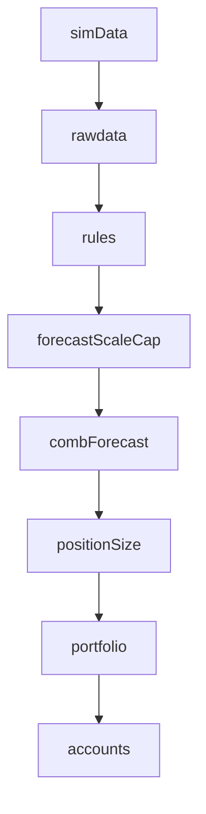

# pysystemtrade — Codebase Architecture Reference

#pysystemtrade #architecture #reference

Related: [[basesystem-and-stage-line-by-line]] | [[accounts-stage-architecture]] | [[systems-folder-overview]] | [[codebase-architecture-part2]]

---

## Top-Level Folder Map

```
syscore/          → Core utilities (no business logic)
sysobjects/       → Domain objects (instruments, contracts, prices, fills)
sysdata/          → Data access abstraction layer
sysquant/         → Quantitative analysis (vol, correlation, optimisation)
systems/          → Backtesting framework (stage-based pipeline)
sysbrokers/       → Broker interface (Interactive Brokers)
sysexecution/     → Order execution and management
sysproduction/    → Production trading orchestration
syscontrol/       → Process lifecycle management
syslogging/       → Python logging configuration
syslogdiag/       → Email-based alert diagnostics
sysinit/          → One-time instrument initialisation scripts
dashboard/        → Flask web UI for monitoring
data/             → Raw CSV data files (prices, config, FX)
private/          → Private config (not in git)
```

---

## Section 1: Core Utilities — `syscore/`

Pure utilities with zero business logic. Used everywhere else.

| File | Key Contents | Purpose |
|---|---|---|
| `constants.py` | `arg_not_supplied`, `named_object` | Sentinel objects for "no value provided" |
| `objects.py` | `get_methods()`, `resolve_function()` | Introspection: list methods, resolve dotted function paths |
| `exceptions.py` | `missingData`, `missingContract` | Custom exception classes |
| `dateutils.py` | Date math, expiry calculations, trading calendar | Date manipulation for futures |
| `fileutils.py` | `resolve_path_and_filename_for_package()` | Resolve dotted paths → filesystem paths |
| `genutils.py` | `flatten_list()`, `progressBar` | General utility functions |
| `maths.py` | `robust_vol_calc()` | Math helpers |
| `cache.py` | `Cache` class | Simple key-value cache (not the system cache) |
| `capital.py` | `apply_crude_capital_multiplier()` | Capital compounding functions |
| `text.py` | `camel_case_split()` | Text parsing (used by dataBlob naming) |
| `pandas/` | `strategy_functions.py`, `pdutils.py`, `frequency.py` | pandas helpers: turnover, resampling, merging |
| `interactive/` | Menu-driven CLI helpers | Used by `sysproduction/interactive_*.py` scripts |

---

## Section 2: Domain Objects — `sysobjects/`

Data classes representing trading concepts. No database logic — just structure and validation.

### Instruments & Contracts

| Class | File | What It Represents |
|---|---|---|
| `futuresInstrument` | `instruments.py` | An instrument code (e.g. `"SP500"`) with metadata |
| `instrumentCosts` | `instruments.py` | Cost data: spread, commission, etc. |
| `contractDate` | `contract_dates_and_expiries.py` | A specific expiry date (e.g. `"20230600"`) |
| `futuresContract` | `contracts.py` | Instrument + contractDate (e.g. SP500/20230600) |
| `listOfFuturesContracts` | `contracts.py` | List of contracts for an instrument |
| `rollParameters` | `rolls.py` | Roll rules: hold/priced/carry offsets |
| `contractDateWithRollParameters` | `rolls.py` | Contract date + its roll rules |
| `rollCalendar` | `roll_calendars.py` | Time series of roll dates |

### Prices

| Class | File | What It Represents |
|---|---|---|
| `futuresContractPrices` | `futures_per_contract_prices.py` | OHLCV for one specific contract |
| `dictFuturesContractPrices` | `dict_of_futures_per_contract_prices.py` | Dict of contract → prices |
| `futuresMultiplePrices` | `multiple_prices.py` | DataFrame: PRICE, CARRY, FORWARD, PRICE_CONTRACT, etc. |
| `futuresAdjustedPrices` | `adjusted_prices.py` | Back-adjusted continuous price series |
| `fxPrices` | `spot_fx_prices.py` | FX rate time series |
| `named_futures_per_contract_prices` | `dict_of_named_futures_per_contract_prices.py` | Prices labeled by role (price/carry/forward) |
| `carryData` | `carry_data.py` | Carry-specific price data |

### Trading

| Class | File | What It Represents |
|---|---|---|
| `fill` / `listOfFills` | `fills.py` | Trade execution records |
| `spreadsForInstrument` | `spreads.py` | Spread time series |
| `production/` subfolder | Various | Position limits, overrides, trade limits, etc. |

---

## Section 3: Data Access Layer — `sysdata/`

Three-tier pattern: **Abstract interface → Backend implementation → dataBlob wiring**.

### 3a. The Pattern

```
baseData                              (sysdata/base_data.py)
    └── futuresAdjustedPricesData     (sysdata/futures/adjusted_prices.py)  ← abstract
            ├── csvFuturesAdjustedPricesData    (sysdata/csv/)              ← CSV backend
            ├── parquetFuturesAdjustedPricesData (sysdata/parquet/)         ← Parquet backend
            └── arcticFuturesAdjustedPricesData  (sysdata/arctic/)          ← Arctic/MongoDB backend
```

Every data type follows this exact pattern.

### 3b. Abstract Interfaces (`sysdata/futures/`)

| Abstract Class | File | Data It Manages |
|---|---|---|
| `futuresAdjustedPricesData` | `adjusted_prices.py` | Back-adjusted continuous prices |
| `futuresContractPriceData` | `futures_per_contract_prices.py` | Per-contract OHLCV prices |
| `futuresMultiplePricesData` | `multiple_prices.py` | Multiple prices (price/carry/forward) |
| `futuresContractData` | `contracts.py` | Contract metadata and expiry info |
| `futuresInstrumentData` | `instruments.py` | Instrument config (point value, currency) |
| `rollParametersData` | `rolls_parameters.py` | Roll rules per instrument |
| `rollCalendarData` | `roll_calendars.py` | Roll date schedules |
| `spreadCostData` | `spread_costs.py` | Spread costs per instrument |
| `spreadsForInstrumentData` | `spreads.py` | Historical spread time series |

### 3c. Backend Implementations

| Backend | Folder | Used For | Connection |
|---|---|---|---|
| **CSV** | `sysdata/csv/` | Backtesting, config, initial data | Filesystem |
| **Parquet** | `sysdata/parquet/` | Production time-series data | Filesystem |
| **MongoDB** | `sysdata/mongodb/` | Production document data | `mongoDb` connection |
| **Arctic** | `sysdata/arctic/` | Legacy time-series (deprecated) | MongoDB via Arctic lib |

### 3d. What's Stored Where (Production)

| Storage | Data Types |
|---|---|
| **Parquet** | Adjusted prices, per-contract prices, multiple prices, FX, capital, positions, spreads |
| **MongoDB** | Contracts, spread costs, roll state, order stacks, overrides, trade limits, process control, locks |
| **CSV** | Instrument config, roll config, spread costs (backtest only) |

### 3e. `dataBlob` — The Dependency Injection Container

**File:** `sysdata/data_blob.py`

The `dataBlob` is used in **production only** (not backtesting). It auto-wires data classes to standardised attribute names based on naming conventions:

```python
data = dataBlob(class_list=[
    parquetFuturesAdjustedPricesData,   # → data.db_futures_adjusted_prices
    mongoFuturesContractData,            # → data.db_futures_contract
    ibFuturesContractPriceData,          # → data.broker_futures_contract_price
])
```

Naming convention: `[backend][DataType]Data` → `data.[prefix]_[snake_case_type]`

| Backend prefix in class name | Attribute prefix on dataBlob |
|---|---|
| `csv` | `db_` |
| `parquet` | `db_` |
| `mongo` | `db_` |
| `arctic` | `db_` |
| `ib` | `broker_` |

### 3f. Sim Data — Backtesting Data Layer

```
simData                           (sysdata/sim/sim_data.py)           ← abstract base
    └── futuresSimData            (sysdata/sim/futures_sim_data.py)    ← futures-specific
            └── csvFuturesSimData (sysdata/sim/csv_futures_sim_data.py) ← reads CSVs
            └── dbFuturesSimData  (sysdata/sim/db_futures_sim_data.py)  ← reads Parquet/Mongo
```

`simData` is used in backtesting (passed to `System()`). It provides methods like `get_raw_price()`, `daily_prices()`, `get_fx_for_instrument()`.

`futuresSimData` adds futures-specific methods: `get_instrument_raw_carry_data()`, `get_backadjusted_futures_price()`, etc.

### 3g. Production Data Adapters (`sysdata/production/`)

Abstract interfaces for production-specific data:

| Class | File | Data |
|---|---|---|
| `capitalData` | `capital.py` | Trading capital tracking |
| `historicOrdersData` | `historic_orders.py` | Completed order archive |
| `optimalPositionData` | `optimal_positions.py` | Strategy optimal positions |
| `overrideData` | `override.py` | Manual trading overrides |
| `positionLimitData` | `position_limits.py` | Per-instrument position limits |
| `tradeLimitData` | `trade_limits.py` | Per-instrument trade limits |
| `rollStateData` | `roll_state.py` | Current roll state per instrument |
| `processControlData` | `process_control_data.py` | Process start/stop/status tracking |

---

## Section 4: Backtesting System — `systems/`

### 4a. Core Infrastructure

| File | Class | Role |
|---|---|---|
| `basesystem.py` | `System` | Container that holds all stages, data, config, cache |
| `stage.py` | `SystemStage` | Base class every stage inherits from |
| `system_cache.py` | `systemCache` | Caching system; `@diagnostic`, `@output`, `@input`, `@dont_cache` decorators |
| `trading_rules.py` | `TradingRule` | Defines a rule as function + data + parameters |

### 4b. Pipeline Stages (execution order)



| Stage | File | Class | `name` | What It Does |
|---|---|---|---|---|
| Raw Data | `rawdata.py` | `RawData` | `rawdata` | Daily prices, vol, carry, FX |
| Rules | `forecasting.py` | `Rules` | `rules` | Applies trading rules → raw forecasts |
| Scale & Cap | `forecast_scale_cap.py` | `ForecastScaleCap` | `forecastScaleCap` | Scales to target, caps at ±20 |
| Combine | `forecast_combine.py` | `ForecastCombine` | `combForecast` | Weighted combination + FDM |
| Position Size | `positionsizing.py` | `PositionSizing` | `positionSize` | Forecast → contract positions via vol targeting |
| Portfolio | `portfolio.py` | `Portfolios` | `portfolio` | Instrument weights + IDM |
| Accounts | `accounts/accounts_stage.py` | `Account` | `accounts` | P&L, costs, Sharpe, performance |

### 4c. Supporting Files

| File | Purpose |
|---|---|
| `buffering.py` | Position buffer calculation functions |
| `forecast_mapping.py` | Forecast transformation (binary → continuous) |
| `diagoutput.py` | Diagnostic output for debugging cached data |
| `risk.py` | Risk calculation helpers |
| `risk_overlay.py` | Reduce positions when risk exceeds cap |

### 4d. Cache Decorators

```python
@input       # does NOT cache — just fetches from another stage
@dont_cache  # does NOT cache — switch/router method
@diagnostic  # CACHES result — intermediate calculation
@output      # CACHES result — final stage output
```

Cache key = `(stage_name, method_name, instrument_code)`.

### 4e. Accounts Module (see [[accounts-stage-architecture]])

```
accountInputs → accountCosts → accountForecast → accountTradingRules ─┐
accountInputs → accountBufferingSystemLevel → accountInstruments      │
                → accountPortfolio → accountWithMultiplier ────────────┤
accountCosts → accountBufferingSubSystemLevel → accountSubsystem ─────┤
                                                                      │
Account(accountTradingRules, accountWithMultiplier, accountSubsystem) ←┘
```

### 4f. Provided Systems (`systems/provided/`)

Pre-built system configs from the book "Leveraged Trading" and "Advanced Futures Trading Strategies".

---

## Section 5: Quantitative Engine — `sysquant/`

Statistical estimation and portfolio optimisation used by backtesting and production.

### Estimators (`sysquant/estimators/`)

| File | Key Class/Function | Purpose |
|---|---|---|
| `vol.py` | `robust_vol_calc`, `mixed_vol_calc` | Volatility estimation (exponential, mixed) |
| `correlations.py` | `CorrelationList`, `correlationEstimate` | Correlation matrix estimation |
| `exponential_correlation.py` | `exponentialCorrelation` | EWMA correlation |
| `correlation_estimator.py` | `correlationEstimator` | Correlation with shrinkage |
| `diversification_multipliers.py` | `diversification_mult_single_period` | IDM/FDM calculation |
| `stdev_estimator.py` | `stdevEstimator` | Standard deviation estimation |
| `mean_estimator.py` | `meanEstimator` | Mean return estimation |
| `forecast_scalar.py` | `forecast_scalar` | Calculate forecast scaling factor |
| `turnover.py` | `turnoverDataForTradingRule` | Turnover estimation |
| `generic_estimator.py` | `genericEstimator` | Base class for rolling estimators |
| `estimates.py` | `Estimates` | Container for mean/covariance estimates |

### Optimisation (`sysquant/optimisation/`)

| File | Purpose |
|---|---|
| `generic_optimiser.py` | Base optimiser interface |
| `portfolio_optimiser.py` | Portfolio weight optimisation |
| `full_handcrafting.py` | "Handcrafted" optimisation (Rob Carver's approach) |
| `SR_adjustment.py` | Sharpe Ratio adjustment for small samples |
| `weights.py` | Weight manipulation utilities |
| `pre_processing.py` | Data preparation for optimisation |
| `cleaning.py` | Correlation/covariance matrix cleaning |
| `optimise_over_time.py` | Rolling window optimisation |

### Other

| File | Purpose |
|---|---|
| `fitting_dates.py` | Generate rolling/expanding date windows |
| `returns.py` | Return calculations: `dictOfReturnsForOptimisation` |
| `portfolio_risk.py` | Portfolio risk decomposition |

---

*Continued in [[codebase-architecture-part2]]*
